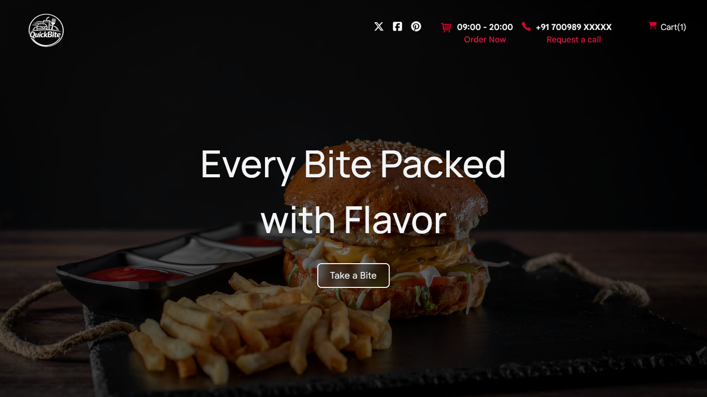
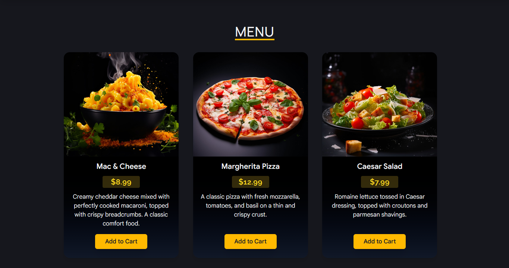

# 🍔 Quick Bite

*Every bite packed with flavor.*

**Quick Bite** is a full-stack food ordering web application built with **React**, **Vite**, **Tailwind CSS**, and **Express.js**.  
It features a single-page menu where users can add meals to the cart, update quantities, and place an order through a checkout form.

The project focuses on building a clean food ordering flow with reusable React components, cart management, modal handling, and backend order submission.

## Features

- Landing page with hero section and food menu
- Display all meals on a single page
- Add meals to the cart directly from the menu
- Increase or decrease item quantity in the cart
- View total cart price before checkout
- Checkout form for submitting an order
- Success message after a successful order submission
- Responsive and modern UI design

## Tech Stack

### Frontend
- **React**
- **Vite**
- **JavaScript / JSX**
- **Tailwind CSS**

### Backend
- **Node.js**
- **Express.js**

## How It Works

1. Browse the available meals and click **Add to Cart** on any meal you want to order.
2. Open the cart from the top-right corner of the page.
3. Update item quantities if needed.
4. Click **Go to Checkout** and fill in your details.
5. Submit the order.
6. A success message will be shown once the order is placed successfully.


## Getting Started

Follow these steps to run the project locally.

### 1. Clone the repository

```bash
git clone https://github.com/NirmalSinghTech1/quick-bite.git
cd quick-bite
```
### 2. Install frontend dependencies
Run this in the root project folder:

```bash
npm install
```

### 3. Install backend dependencies
Move to the backend folder and install backend packages:

```bash
cd backend
npm install
```

## Running the Application

### Start the frontend
From the root project folder, run:

```bash
npm run dev
```

### Start the backend
From the backend folder, run:

```bash
npm run start
```

### Local Development
After starting both the frontend and backend servers, open the frontend in your browser.
If you are using the default Vite setup, it will usually run on:

```bash
http://localhost:5173
```
>Make sure the backend server is also running so cart and order submission work properly.


## Preview

### Homepage


### Menu Section


## Connect With Me 

[LinkedIn](https://www.linkedin.com/in/nirmal-singh-5005b92b2)
[Twitter](https://x.com/nirmalsingh_007)
